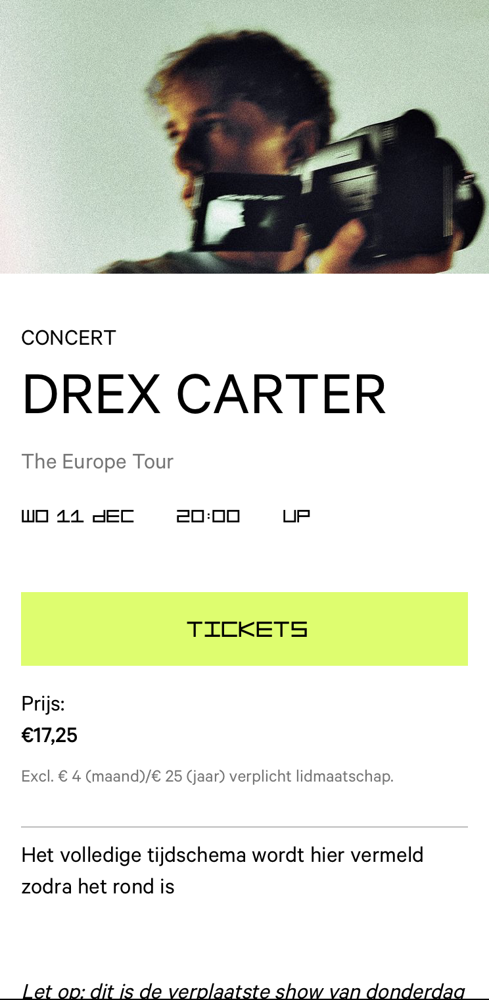

# Procesverslag
Markdown is een simpele manier om HTML te schrijven.  
Markdown cheat cheet: [Hulp bij het schrijven van Markdown](https://github.com/adam-p/markdown-here/wiki/Markdown-Cheatsheet).

Nb. De standaardstructuur en de spartaanse opmaak van de README.md zijn helemaal prima. Het gaat om de inhoud van je procesverslag. Besteedt de tijd voor pracht en praal aan je website.

Nb. Door *open* toe te voegen aan een *details* element kun je deze standaard open zetten. Fijn om dat steeds voor de relevante stuk(ken) te doen.

## Jij

  
uitwerken voor kick-off werkgroep

  ### Auteur:
  Iris Baltus

  #### Je startniveau:
  tussen blauw en rood in

  #### Je focus:
  responsive
 

## Je website

  
uitwerken voor kick-off werkgroep

  ### Je opdracht:
  https://www.melkweg.nl/nl/ 
  
  #### Screenshot(s) van de eerste pagina (small screen): 
  hier de naam van de pagina  
  

  #### Screenshot(s) van de tweede pagina (small screen):
  hier de naam van de pagina  
  
 

## Toegankelijkheidstest 1/2 (week 1)

  
uitwerken na test in 2e werkgroep

  ### Bevindingen
  Lijst met je bevindingen die in de test naar voren kwamen:
  De structuur van de site is duidelijk en alles wordt overzichtelijk benoemd in de screenreeder
  De h1 t/m h6 zijn overzichtelijk ingedeeld
  skip link is goed
 

## Breakdownschets (week 1)

  
uitwerken na afloop 3e werkgroep

  ### de hele pagina: 
  

  ### dynamisch deel (bijv menu): 
  

  ### wellicht nog een dynamisch deel (bijv filter): 
  

 

## Voortgang 1 (week 2)

  
uitwerken voor 1e voortgang

  ### Stand van zaken
  hier dit ging goed & dit was lastig (neem ook screenshots op van delen van je website en code)

  ### Agenda voor meeting
  samen met je groepje opstellen

  | student 1          | student 2          | student 3    | student 4        |
  | ---                | ---                | ---          | ---              |
  | Het font krijg ik  | tips over hoe ik     feedback over  en ik dit    | en dan ik dat    |
  | nog niet in mijn   | het logo kan gaan  | de html      | dit wil ik zeker |
  | css, hier wil ik     animeren
    hulp bij           | ...                | ...          | ...              |

  ### Verslag van meeting
  hier na afloop snel de uitkomsten van de meeting vastleggen

  - Voor het logo moet ik even advies vragen aan Sanne. Jason en Jesse denken dat dit svg's zijn die geanimeerd worden.  
  - Voor het menu werd aangeraden een header te gebruiken, op mobiel een position: absolute onder pagina en voor desktop naar boven op de pagina.
  - Het inladen van het font is nu gelukt gelukkig.
  - Ik heb buttons waar een h3 om heen zit, de h3 is niet nodig.
  - De alt teksten herhalen eigenlijk de titles, dus de alt-teksten zijn onnodig.

## Voortgang 2 (week 3)

  
uitwerken voor 3e voortgang

  ### Stand van zaken
  hier dit ging goed & dit was lastig (neem ook screenshots op van delen van je website en code)

  ### Agenda voor meeting
  samen met je groepje opstellen

  | De achtergrond van mijn      | 'Young creatives' wil zich niet opbreken        | student 3    | student 4        |
  | button wil maar niet wit worden | in mijn nav, dit wil wel gezien de        | ---          | ---              |
  | terwijl ik wel een kleur als  | melkweg dit ook heeft          | en ik dit    | en dan ik dat    |
  | background eigenschap heb gegeven|                | nog een punt | dit wil ik zeker |
  | hoe kan dit anders?          | ...                | ...          | ...              |

  ### Verslag van meeting
  hier na afloop snel de uitkomsten van de meeting vastleggen

  - Voor de kleur van mijn button bleek dat ik de verkeerde kleur in mijn :root had staan, dit was ligt grijs ipv wit. Hierdoor zag het er exact hetzelfde uit als de default button. Gelukkig dus makkelijk op te lossen
  - Voor de nav ben ik te moeilijk gaan denken, ik ben alles gaan proberen te flexen en in een grid gaan zetten echter bleek dit allemaal niet nodig te zijn. Samen met Docent Sanne hebben ik dit in een display:block gezet, hierdoor breekt het automatisch af naar de volgende regel zodra het niet meer past.
  - nog een punt
  - ...

## Voortgang 3 (week 4)

  
uitwerken voor 2e voortgang

  ### Stand van zaken
  hier dit ging goed & dit was lastig (neem ook screenshots op van delen van je website en code)

  ### Agenda voor meeting
  samen met je groepje opstellen

  | student 1      | student 2          | student 3    | student 4        |
  | ---            | ---                | ---          | ---              |
  | img on hover komt | 'just announced' en | Wanneer ik hover over de a van            | en ik dit    | en dan i    |
  | buiten de borders | 'next up' staan nu |  | de agenda veranderd alleen de |
  | ik gebruik wel al    onder elkaar, dit wil |  achtergrond en de h2 en svg 
  overflow:hidden, echter  ik zichtbaar tonen per  veranderen pas als ik daarbinnen hover
  werkt het nog niet    | button, advies vragen     | over hover. Ik wil dat alles tegelijk       | ...              |
                        voor hoe ik dit kan doen     verandert

  ### Verslag van meeting
  hier na afloop snel de uitkomsten van de meeting vastleggen

  - Jesse en Jason hebben meerdere manieren voor het scalen van de img zonder dat dit buiten de border valt laten zien, deze methodes had ik zelf echter ook al uitgeprobeerd en werkten niet. Jesse en jason kwamen uiteindelijk tot 
  de conclusie dat ik een losse div om mijn img heen moest doen om dit te laten werken. De codes die ik zlef al had uitgezocht werkten perfect nadat ik later thuis een div om mijn img heb gezet.
  - De 'just announced' en 'next up' zijn volgens Jesse en Jason op te lossen door hier checkboxes van te maken en aan te spreken in javascript
  - Wanneer ik over de a van de agenda hoverde vernaderde alleen de achtergrond, de h2 en svg veranderde alleen wanneer je hier los overheen hoverd. Dit wilde ik echter allemaal te tegelijk. Tijdens de meeting hebben Jesse en Jason mijn uitgelegd hoe kan nestellen in mijn css. Door eerst de a:hover als geheel aan te spreken en daar binnen de h2 en svg, geef je dus aan dat wanneer je over de a hoverd ook deze eigenschappen worden aangepast.
- ...

## Toegankelijkheidstest 2/2 (week 4)

  
uitwerken na test in 9e werkgroep

  ### Bevindingen
  Lijst met je bevindingen die in de test naar voren kwamen (geef ook aan wat er verbeterd is):

  H4 Teaches of peaches (2024) staat er 3 keer hetzlfde in, het enige verschil is de datum echter is dit niet te zien in de screenreader.
  h1 en h2 melkweg.
  de focus state is zichtbaar, dit kan echter duidelijker zichtbaar doormiddel van contrasten.
  Skip link naar Just announced en next up is er nog niet
  Animatie voorzien van prefers-reduced-motion media query

## Voortgang 3 (week 3)

  
uitwerken voor 3e voortgang

  ### Stand van zaken
  hier dit ging goed & dit was lastig (neem ook screenshots op van delen van je website en code)

  ### Agenda voor meeting
  samen met je groepje opstellen

  | student 1      | student 2          | student 3    | student 4        |
  | ---            | ---                | ---          | ---              |
  | img on hover komt | 'just announced' en | Wanneer ik hover over de a van            | en ik dit    | en dan i    |
  | buiten de borders | 'next up' staan nu |  | de agenda veranderd alleen de |
  | ik gebruik wel al    onder elkaar, dit wil |  achtergrond en de h2 en svg 
  overflow:hidden, echter  ik zichtbaar tonen per  veranderen pas als ik daarbinnen hover
  werkt het nog niet    | button, advies vragen     | over hover. Ik wil dat alles tegelijk       | ...              |
                        voor hoe ik dit kan doen     verandert

  ### Verslag van meeting
  hier na afloop snel de uitkomsten van de meeting vastleggen

  - Jesse en Jason hebben meerdere manieren voor het scalen van de img zonder dat dit buiten de border valt laten zien, deze methodes had ik zelf echter ook al uitgeprobeerd en werkten niet. Jesse en jason kwamen uiteindelijk tot 
  de conclusie dat ik een losse div om mijn img heen moest doen om dit te laten werken. De codes die ik zlef al had uitgezocht werkten perfect nadat ik later thuis een div om mijn img heb gezet.
  - De 'just announced' en 'next up' zijn volgens Jesse en Jason op te lossen door hier checkboxes van te maken en aan te spreken in javascript
  - Wanneer ik over de a van de agenda hoverde vernaderde alleen de achtergrond, de h2 en svg veranderde alleen wanneer je hier los overheen hoverd. Dit wilde ik echter allemaal te tegelijk. Tijdens de meeting hebben Jesse en Jason mijn uitgelegd hoe kan nestellen in mijn css. Door eerst de a:hover als geheel aan te spreken en daar binnen de h2 en svg, geef je dus aan dat wanneer je over de a hoverd ook deze eigenschappen worden aangepast.
- ...

## Eindgesprek (week 5)

  
uitwerken voor eindgesprek

  ### Je uitkomst - karakteristiek screenshots:
  

  ### Dit ging goed/Heb ik geleerd: 
  Korte omschrijving met plaatjes

  

  ### Dit was lastig/Is niet gelukt:
  Korte omschrijving met plaatjes

  

## Bronnenlijst

  
continu bijhouden terwijl je werkt

  Nb. Wees specifiek ('css-tricks' als bron is bijv. niet specifiek genoeg). 
  Nb. ChatGpT en andere AI horen er ook bij.
  Nb. Vermeld de bronnen ook in je code.

  1. Letter m gemaakt samen met Sanne, deze kennis heb ik gebruikt voor mijn volgende animaties
  2. https://www.a11yproject.com/posts/how-to-hide-content/ visually hidden class
  3. 

